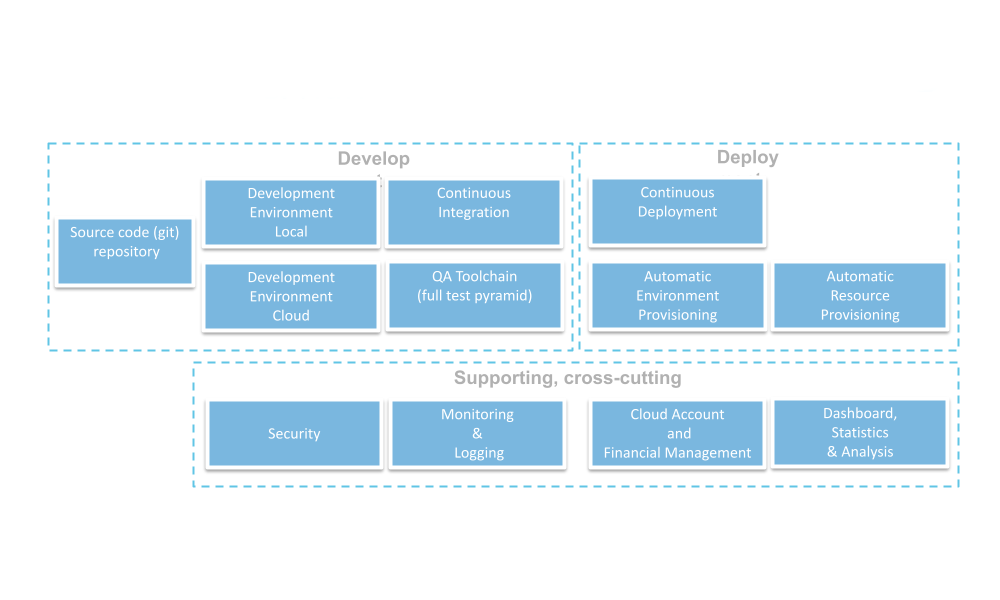
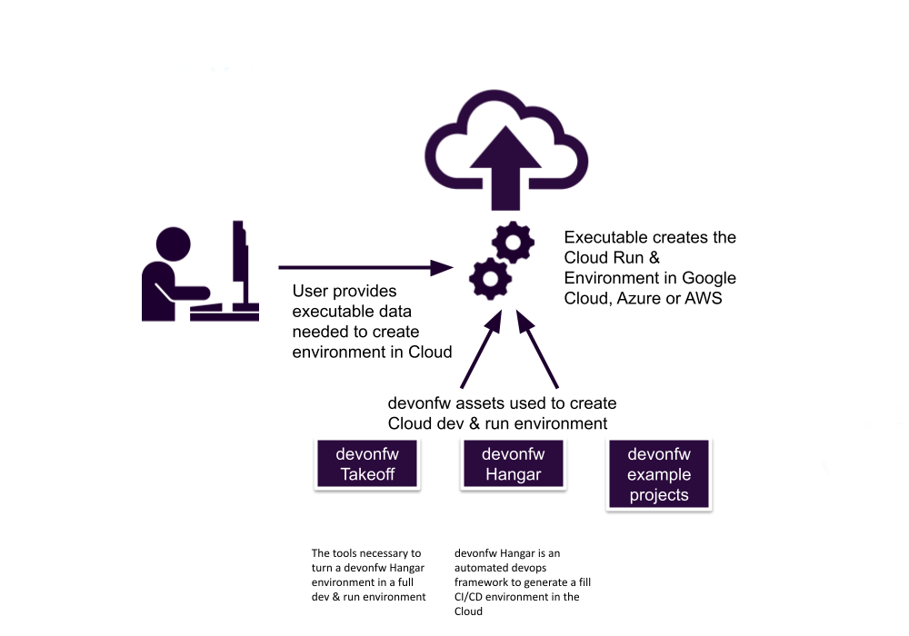

# Takeoff - quickstart a complete Cloud based Dev & Run environment

## Introduction

We define a “Cloud based Dev & Run environment” as a subscription at a public cloud provider 
(Google Cloud, AWS, Microsoft Azure) to develop, deploy, run and manage software applications 
on a sophisticated infrastructure that is owned and provided by the cloud provider and managed 
as a single entity by the client or Capgemini. The environment contains everything which is 
needed for the development, continuous integration and deployment, provisioning, orchestration 
and monitoring of the application and dependent resources. It also includes all services needed 
for (financial) management and administration of the subscription/environment itself.



Takeoff is a simple, Open Source, solution with which one create a complete Cloud based Dev & Run 
environment with a single command or executable. The resulting environment contains a fully working 
full-stack example application in source code form which is automatically compiled and build in 
the same environment.  This asset can be used to accelerate and industrialize to a large extent 
Cloud based development.



## Installation
### as a user

You can download a version of takeoff for you Operating System (Windows, MacOS or Linux) here:

### as a developer

Install Rust:

 - [Rust documentation](https://www.rust-lang.org/tools/install)

and then compile and run takeoff with 

```bash

cargo run help 
   
```
which show the help info

# Prerequisites and documentation

Usage of takeoff requires a working installation of a "Container run-time". To see
what this means, check out:

 - [Containers and Container runtimes for Beginners](https://devopstales.github.io/home/container-runtimes/)

Takeoff uses devonfw Hangar but does so transparently so you don't have to install it. However it 
is extremely usefull in its own right, so it's recommeded to take a look

 - [devonfw Hangar](https//github.com/devonfw/hangar)

For using Rust to create console apps:

- [Command line apps in Rust](https://rust-cli.github.io/book/index.html)
- [The Rust Cookbook](https://rust-lang-nursery.github.io/rust-cookbook/)

## Usage

```bash

takeoff commands:
 
Format: takeoff <command> <parameter1, parameter2, …>
The following commands are supported:
 
list 	 - show installed, configured dev&run environment
create	- configure dev&run environment
clean  	- delete local .cache of installed, configured dev&run environment (does NOT remove  cloud env)
run       -  open container in terminal mode with connection data to dev&run env set
help 	- Info 

takeoff create GC ivanderk@capgemini.com native-dev-demo
 
takeoff list 

Results in:

GC	native-dev-demo (ivanderk@capgemini.com)
AWS	data-dons  (martmart@capgemini.com)
GC	big-query-data-lake (ivanderk@capgemini.com)

takeoff clean native-dev-demo
 
takeoff run native-dev-demo
 
Results in:
Opening container connection with terminal prompt in bash
 
```

## Contributing
Pull requests are welcome. For major changes, please open an issue first to discuss what you would like to change.

Please make sure to update tests as appropriate.

## License

 Licensed under the Apache License, Version 2.0 (the "License"); 
 you may not use this file except in compliance with the License. 
 You may obtain a copy of the License at

[http://www.apache.org/licenses/LICENSE-2.0](http://www.apache.org/licenses/LICENSE-2.0)

Unless required by applicable law or agreed to in writing, software
distributed under the License is distributed on an "AS IS" BASIS,
WITHOUT WARRANTIES OR CONDITIONS OF ANY KIND, either express or implied.
See the License for the specific language governing permissions and
limitations under the License.

